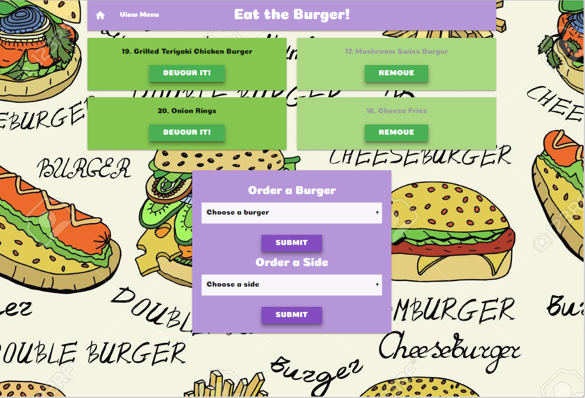
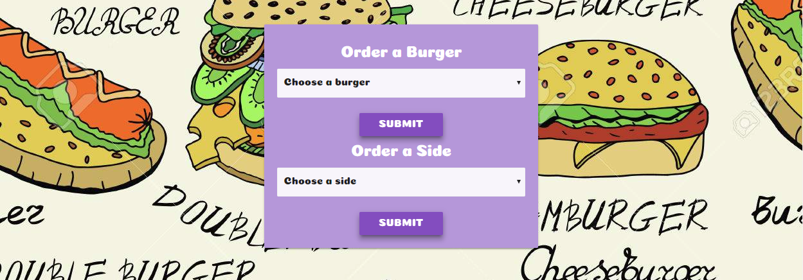
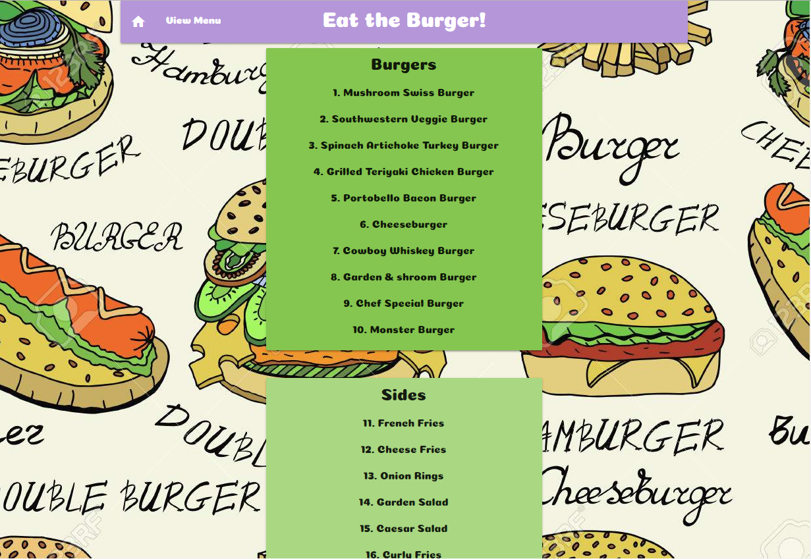

# Eat the Burger!

This app was created during mod-14 of the DU web dev bootcap 2017/2018. It was built with Node, Express, Handlebars, and an ORM. It uses the MVC design pattern, Node and MySQL to query and route data to the app, and Handlebars to generate the HTML.

## Getting Started
Live App Link: https://gentle-citadel-47852.herokuapp.com/

## Screen Shots


Index Page


Form to create new burgers or sides to 'devour' from drop down menus


Menu Page - Displays all available Burgers and Sides

## Technologies used
- Node.js
- MySQL
- Handlebars - http://handlebarsjs.com/
- body-parser NPM Package - https://www.npmjs.com/package/inquirer
- express NPM Package - https://www.npmjs.com/package/express
- mysql NPM Package - https://www.npmjs.com/package/mysql
- handlebars NPM Package - https://www.npmjs.com/package/handlebars
- express-handlbars NPM Package - https://www.npmjs.com/package/express-handlebars

### Prerequisites

```
- Node.js - Download the latest version of Node https://nodejs.org/en/
- Materialize - Add CDN link http://materializecss.com/getting-started.html
```

## Built With

* Visual Studio Code - Text Editor
* Materialize - Wireframe
* MySql Workbench

## Authors

* **Jeffrey Phelps** - *JS/Node.js/Handlebars* - [Jeffrey Phelps](https://github.com/JeffreyPhelps)
